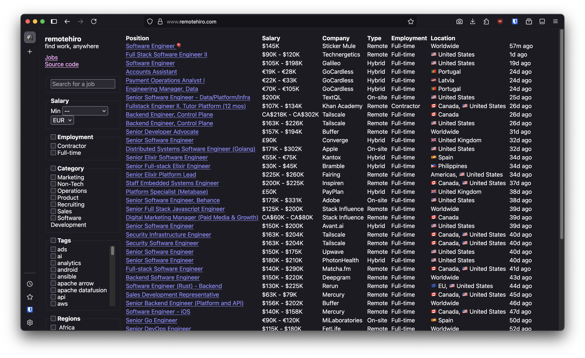

# remotehiro

find work, anywhere

## What's remotehiro?

remotehiro is a job board with performance, accessibility, and focus in mind.

- **Defined salary ranges.** Don't waste your time guessing what salary is being
offered.
- **Multi-currency support**. Browse and filter through jobs in your preferred
currency.
- **No middleman.** remotehiro does not act as a middleman between you, and
the company.
- **FOSS.** remotehiro is licensed under an OSI approved license, and its source
code is available for you to browse.
- **Extremely lightweight.** remotehiro is optimized for performance, and only
cares about presenting jobs to applicants.
    - HTML documents are at most 14kB uncompressed, and ~2kB compressed.
    - JS assets are individually <1kB __uncompressed__.
    - CSS assets are individually ~1kB uncompressed, and <1kB compressed.
- **Accessible.** You don't need an account to browse jobs. You don't even need
to visit remotehiro.com to browse jobs. You can view jobs via other means:
    - RSS feed
    - [`@remotehiro.com`](https://bsky.app/profile/remotehiro.com) on Bluesky 🦋
- **No third-party trackers.** remotehiro does not sell your data to third-party
entities.

## Why?

I wanted to make a job board that focuses on the core essence of what a job board
is supposed to be. Public data, no paywalls, no ads, lightweight, and straightforward.

## Funding

At the moment, you may donate via [GitHub sponsors](https://github.com/sponsors/tacohirosystems)
if you find the platform helpful!

## License

Copyright © SEKUN, 2025-present.

Licensed under the EUPL v1.2. For other translations of the license, refer to
https://interoperable-europe.ec.europa.eu/collection/eupl/eupl-text-eupl-12.
